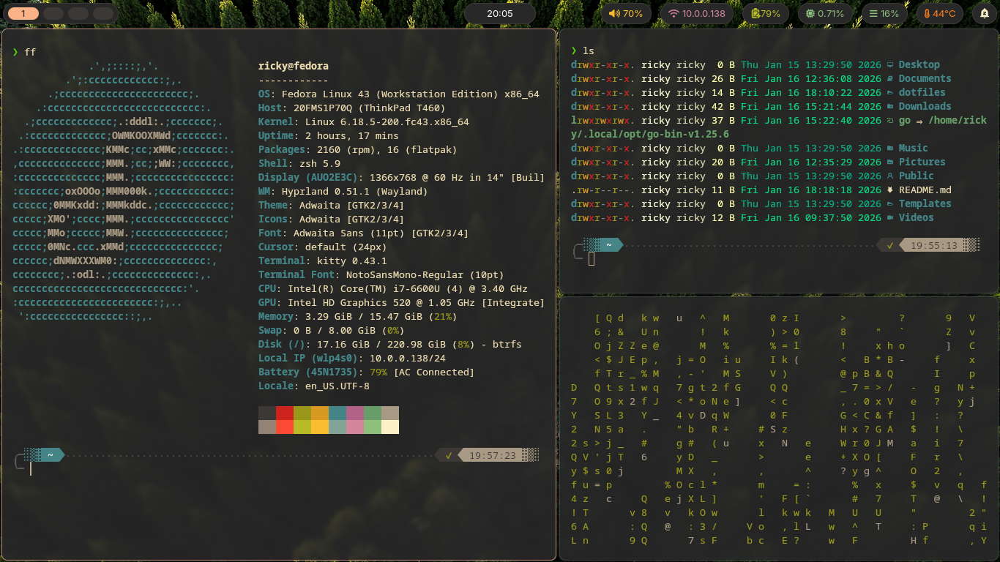
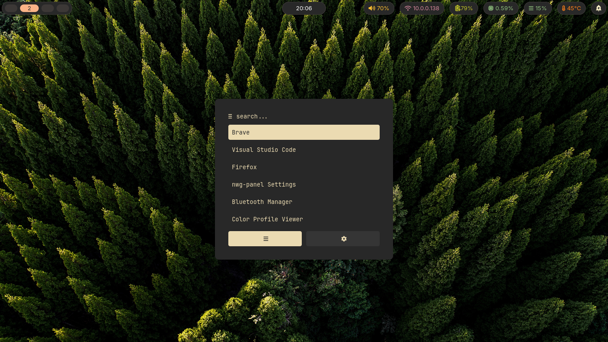

# My Minimalist Hypland/Fedora setup (So far)

## Apps & Tools I Use

| Category | Tool |
|--------|------|
| 🪟 Window Manager | Hyprland |
| 📊 Status Bar | Waybar |
| 🚀 App Launcher | Rofi |
| 🖼️ Image Viewer | Ristretto |
| 🐧 Linux Distro | Fedora |
| 🐚 Shell | Zsh |
| 🎨 Shell Framework | Oh My Zsh |
| ✨ Prompt Theme | Powerlevel10k |
| 🔤 Font | JetBrains Mono (Nerd Fonts) |

## Screenshots

---
