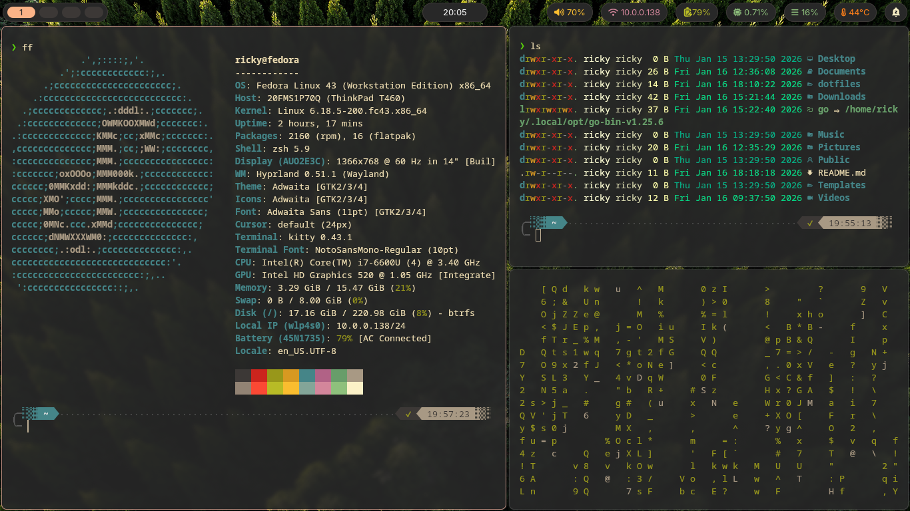
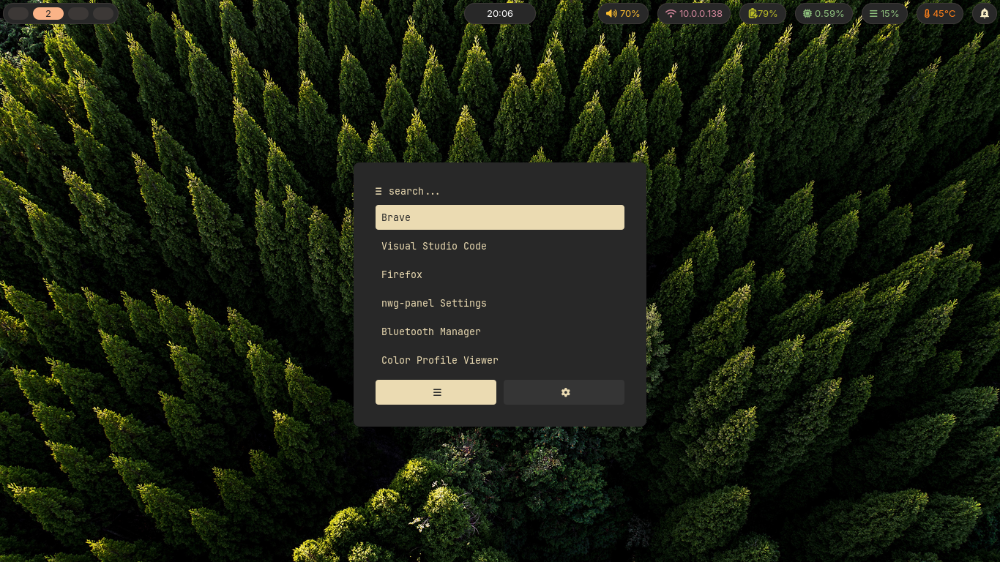

# My Minimalist Hyprland setup (Fedora)

## Apps & Tools I Use

| Category | Tool |
|--------|------|
| 🪟 Window Manager | Hyprland |
| 📊 Status Bar | Waybar |
| 🚀 App Launcher | Rofi |
| 🖼️ Image Viewer | Ristretto |
| 🐧 Linux Distro | Fedora Workstation |
| 🐚 Shell | Zsh |
| 🎨 Shell Framework | Oh My Zsh |
| ✨ Prompt Theme | Powerlevel10k |
| 🔤 Font | JetBrains Mono (Nerd Fonts) |

## What `setup.sh` does

- Verifies you're on Fedora (bails if not).
- Detects Broadcom BCM43xx wifi. On a MacBook Air A1466, installs the
  bundled offline `wl` driver RPMs from `wifi/rpms/` so wifi works
  before the online package install runs. On a PC this step is skipped.
- Enables RPM Fusion (free + nonfree) and the `solopasha/hyprland` COPR.
- Installs Hyprland, Waybar, Kitty, Rofi (Wayland), btop, swww, swaync,
  nwg-panel, nwg-look, PipeWire, pavucontrol, and the rest via `dnf`.
- Installs Oh My Zsh + Powerlevel10k, sets zsh as the default shell.
- Installs the JetBrains Mono Nerd Font if missing.
- Symlinks `hypr/`, `waybar/`, `kitty/`, `rofi/`, `btop/`, `nwg-panel/`,
  `nwg-look/`, and `ristretto/` into `~/.config/`. Pre-existing configs
  are backed up to `~/.config/<name>.bak.<timestamp>` before linking,
  so rerunning is safe.

## Install on a PC (has working wifi or ethernet)

1. Install Fedora Workstation and connect to the network.
2. Clone and run:
   ```sh
   git clone <this-repo> ~/Documents/dotfiles
   cd ~/Documents/dotfiles
   ./setup.sh
   ```
3. Log out and pick **Hyprland** from the display manager's session list.
4. On the first zsh launch, follow the Powerlevel10k wizard.

No Broadcom BCM43xx chip is detected, so the wifi step is skipped
automatically — the bundled RPMs cost nothing on a PC.

## Install on a MacBook Air A1466 (offline wifi)

The BCM4360 wifi chip needs the proprietary `wl` driver, and a fresh
Fedora install has no wifi until it's installed. The driver RPMs are
bundled in `wifi/rpms/` so the first boot works without internet.

### One-time, on any Fedora machine with internet

Populate `wifi/rpms/` and push to GitHub:

```sh
cd ~/Documents/dotfiles
./wifi/download-drivers.sh
git add wifi/rpms
git commit -m "refresh wifi drivers for Fedora $(rpm -E %fedora)"
git push
```

Run this whenever you move to a new Fedora release. See
[`wifi/README.md`](wifi/README.md) for why `kernel-devel` matters.

### On the MacBook, fresh install

1. Install Fedora Workstation from USB. **Do not update packages yet.**
2. Without connecting to wifi, copy this repo onto the machine (USB
   stick is easiest — `git clone` it somewhere with internet first,
   then copy the whole directory).
3. Run the setup:
   ```sh
   cd ~/Documents/dotfiles
   ./setup.sh
   ```
   The script detects the Broadcom chip, installs the bundled driver
   RPMs offline, rebuilds the kmod against the running kernel, and
   `modprobe wl`s.
4. If the script stops after the wifi step (modprobe failed or a
   reboot is needed): reboot, connect to wifi via the GNOME network
   icon, then re-run `./setup.sh`. It skips everything already done
   and continues with the package install.
5. Log out and pick **Hyprland** from the display manager's session list.
6. On the first zsh launch, follow the Powerlevel10k wizard.

## Screenshots



